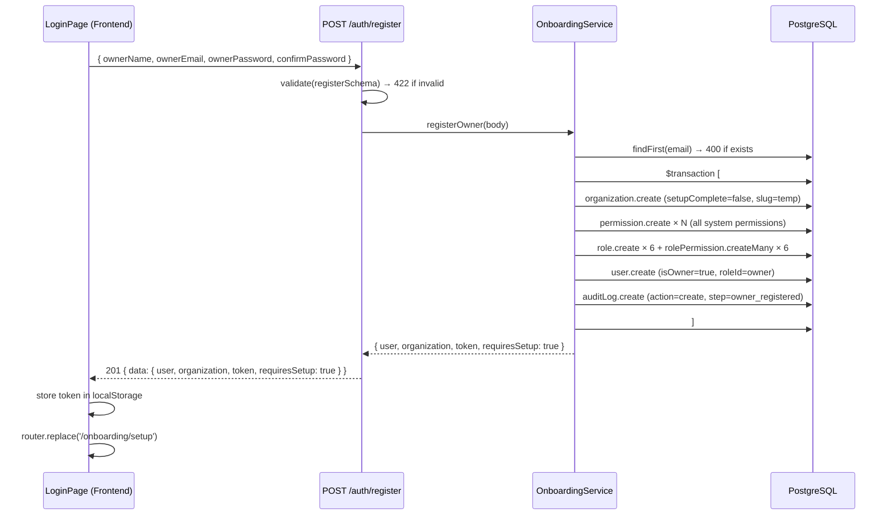
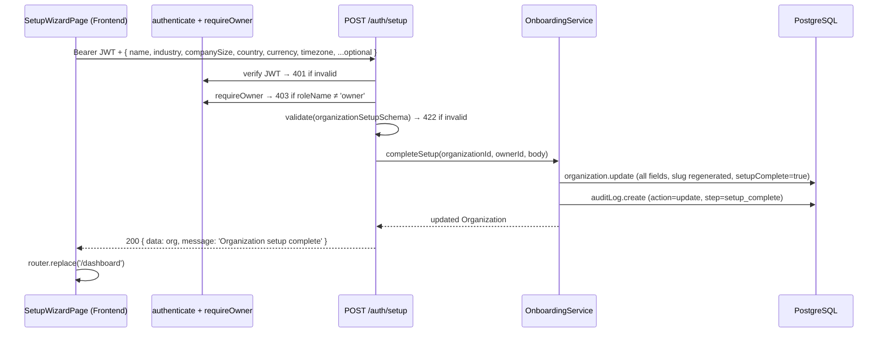
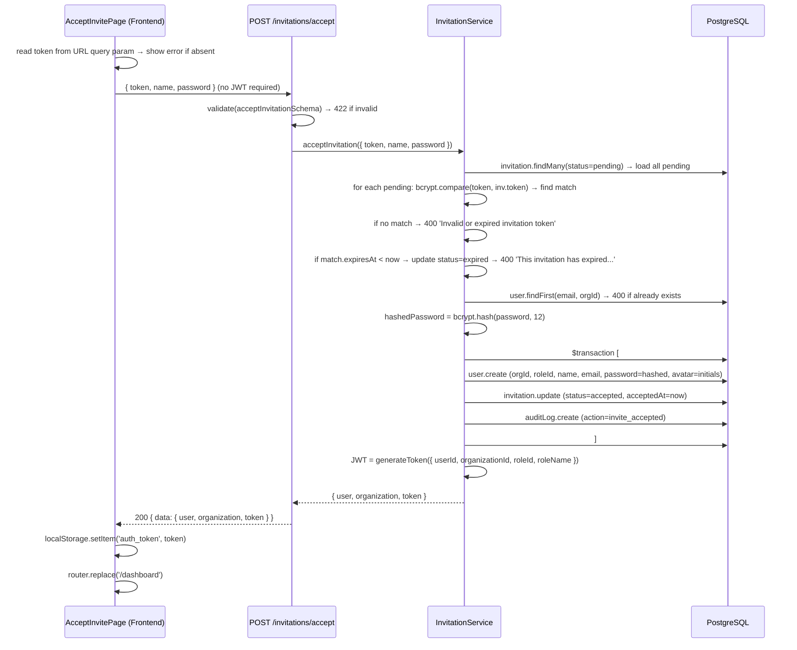

# Design Document: Onboarding Flow

## Overview

This document describes the technical design for the production-grade onboarding flow of the multi-tenant SaaS CRM. It covers two primary onboarding paths — the Owner path (registration → setup wizard → dashboard) and the Invited User path (invitation email → acceptance → dashboard) — plus the invitation management lifecycle.

The system is built on an Express/TypeScript/Prisma backend and a Next.js 16 App Router frontend. Most of the core logic is already implemented; this design formalizes the architecture, documents known gaps, and specifies correctness properties for property-based testing.

---

## Architecture

```
┌─────────────────────────────────────────────────────┐
│                    Frontend (Next.js 16)              │
│                                                       │
│  RootLayoutClient (Route Guard)                       │
│  ├── /login              LoginPage                    │
│  ├── /onboarding/setup   SetupWizardPage              │
│  ├── /invitations/accept AcceptInvitePage             │
│  └── /dashboard          DashboardPage (protected)    │
│                                                       │
│  AuthContext ─── localStorage(auth_token)             │
└──────────────────────┬──────────────────────────────┘
                       │ HTTP (JSON + Bearer JWT)
┌──────────────────────▼──────────────────────────────┐
│                  Backend (Express/TypeScript)          │
│                                                       │
│  Routes                                               │
│  ├── /auth/*      auth.routes.ts                      │
│  └── /invitations/* invitation.routes.ts              │
│                                                       │
│  Middleware Stack                                     │
│  ├── authenticate  (verify JWT, load permissions)     │
│  ├── requireRole   (roleName check)                   │
│  ├── requirePermission (permission check)             │
│  └── validate      (Zod schema)                       │
│                                                       │
│  Services                                             │
│  ├── OnboardingService   (register, completeSetup)    │
│  ├── AuthService         (login, profile, password)   │
│  └── InvitationService   (send, accept, manage)       │
│                                                       │
│  Utils                                                │
│  ├── jwt.ts   (generateToken, verifyToken)            │
│  ├── errors.ts (typed HTTP errors)                    │
│  └── response.ts (sendSuccess helper)                 │
└──────────────────────┬──────────────────────────────┘
                       │ Prisma Client
┌──────────────────────▼──────────────────────────────┐
│               PostgreSQL Database                     │
│  organizations, users, roles, permissions,            │
│  role_permissions, invitations, audit_logs            │
└─────────────────────────────────────────────────────┘
```

---

## Data Models

The Prisma schema already defines all required tables. The key relationships for the onboarding flow are:

```
Organization ─1──n─ User
Organization ─1──n─ Role
Organization ─1──n─ Permission
Role ─m──n─ Permission  (via RolePermission)
User ─n──1─ Role
User ─1──n─ Invitation (as invitedBy)
Organization ─1──n─ Invitation
Organization ─1──n─ AuditLog
User ─1──n─ AuditLog
```

### Key Fields for Onboarding

**Organization**
| Field | Type | Purpose |
|---|---|---|
| `id` | UUID | Tenant identifier, system-generated |
| `slug` | String (unique) | Temporary slug at registration, regenerated on setup |
| `setupComplete` | Boolean | Gate that drives route guard and setup redirect |
| `name` | String | Placeholder `'My Organization'` until setup |

**User**
| Field | Type | Purpose |
|---|---|---|
| `isOwner` | Boolean | Exactly one per org; drives ownership invariant |
| `lastLoginAt` | DateTime? | Updated on every successful login |
| `avatar` | String? | Auto-initialized to 2-char initials; updated via profile |

**Invitation**
| Field | Type | Purpose |
|---|---|---|
| `token` | String (unique) | bcrypt hash of the raw 32-byte token |
| `status` | Enum | pending → accepted / expired / revoked |
| `expiresAt` | DateTime | 72 hours from creation |

---

## Owner Onboarding Path

### Sequence: Registration



### Sequence: Setup Wizard Completion



### Route Guard Logic (Owner Path)

The `RootLayoutClient` runs a `useEffect` on every route change:

```
if (isLoading) → show spinner
if (!user && !isPublicRoute) → router.replace('/login')
if (user && !setupComplete && pathname !== '/onboarding/setup') → router.replace('/onboarding/setup')
if (user && setupComplete && pathname === '/login') → router.replace('/dashboard')
```

`PUBLIC_ROUTES = ['/login', '/onboarding/setup', '/invitations/accept']`

The setup wizard page has its own local guard:
```
if (!user) → router.replace('/login')
if (user.organization?.setupComplete) → router.replace('/dashboard')
```

---

## Invited User Onboarding Path

### Sequence: Invitation Sending

```mermaid
sequenceDiagram
    participant F as Dashboard (Frontend)
    participant M as authenticate + requirePermission('user.invite')
    participant B as POST /invitations
    participant S as InvitationService
    participant DB as PostgreSQL
    participant E as Email Service

    F->>B: Bearer JWT + { email, roleId }
    B->>M: authenticate → load permissions from DB
    B->>M: requirePermission('user.invite') → 403 if missing
    B->>B: validate(sendInvitationSchema) → 422 if invalid
    B->>S: sendInvitation(inviter, { email, roleId })
    S->>DB: role.findFirst(roleId, orgId) → 404 if not found
    S->>S: check INVITE_PERMISSIONS[inviter.roleName].includes(role.name) → 403 if not allowed
    S->>DB: user.findFirst(email, orgId) → 400 if already member
    S->>DB: invitation.updateMany(email+orgId+pending → expired)
    S->>S: rawToken = crypto.randomBytes(32).hex()
    S->>S: tokenHash = bcrypt.hash(rawToken, 10)
    S->>DB: invitation.create (token=tokenHash, expiresAt=now+72h)
    S->>DB: auditLog.create (action=invite_sent)
    S-->>B: { invitation, inviteToken: rawToken }
    B->>E: send email with link: FRONTEND_URL/invitations/accept?token=rawToken
    E-->>B: (fire-and-forget; log failure, never rollback)
    B-->>F: 201 { data: { invitation, inviteToken } }
```

### Sequence: Invitation Acceptance



---

## Login and Session Routing

### Login Response Shape

`AuthService.login()` must return the user with the organization included so the frontend can evaluate `setupComplete`. The current implementation returns `userSafe` which strips only the password — the Prisma query must include the organization relation:

```typescript
// Required include in AuthService.login():
include: {
  role:         { select: { id, name, displayName } },
  organization: { select: { id, name, setupComplete, country, currency } },
}
```

### Login Routing Logic (Frontend)

```
POST /auth/login → success
  └─ if organization.setupComplete === false → router.replace('/onboarding/setup')
  └─ if organization.setupComplete === true  → router.replace('/dashboard')
```

Already-authenticated users hitting `/login` are caught by the route guard and redirected accordingly.

---

## Invitation Management

### Endpoints

| Method | Path | Auth | Permission |
|---|---|---|---|
| `POST` | `/invitations` | JWT | `user.invite` |
| `GET` | `/invitations` | JWT | `user.invite` |
| `POST` | `/invitations/:id/resend` | JWT | `user.invite` |
| `DELETE` | `/invitations/:id` | JWT | `user.invite` |
| `POST` | `/invitations/accept` | None | — |

### Resend Flow

1. Validate caller can invite the invitation's role (hierarchy check)
2. `invitation.update(id, { status: 'expired' })`
3. Generate fresh `rawToken` + `tokenHash`
4. `invitation.create(...)` with new 72h expiry
5. Return `{ invitation, inviteToken: rawToken }` for email re-delivery

### Revoke Flow

1. `invitation.findFirst(id, orgId, status=pending)` → 404 if not found
2. `invitation.update(id, { status: 'revoked' })`
3. `auditLog.create(action='delete', resource='invitation', metadata={ action: 'revoked' })`

---

## API Contract Summary

### POST /auth/register

**Auth:** None  
**Body:**
```json
{
  "ownerName": "string (min 1)",
  "ownerEmail": "string (email)",
  "ownerPassword": "string (min 8)",
  "confirmPassword": "string (must match ownerPassword)"
}
```
**Response 201:**
```json
{
  "user": { "id", "name", "email", "organizationId", "roleId", "isOwner": true },
  "organization": { "id", "name", "slug", "setupComplete": false },
  "token": "JWT",
  "requiresSetup": true
}
```
**Errors:** 400 (email exists), 422 (validation)

---

### POST /auth/login

**Auth:** None  
**Body:** `{ "email": "string", "password": "string" }`  
**Response 200:**
```json
{
  "user": {
    "id", "name", "email", "roleId", "organizationId",
    "role": { "id", "name", "displayName" },
    "organization": { "id", "name", "setupComplete", "country", "currency" }
  },
  "token": "JWT"
}
```
**Errors:** 401 (invalid credentials)

---

### POST /auth/setup

**Auth:** Bearer JWT (owner role required)  
**Body:**
```json
{
  "name": "string (min 2)",
  "industry": "string",
  "companySize": "string",
  "country": "ISO-3166-1 alpha-2",
  "currency": "ISO-4217 alpha-3",
  "timezone": "IANA timezone",
  "website": "url (optional)",
  "phone": "string (optional)",
  "address": "string (optional)",
  "fiscalYear": "integer 1–12 (optional)",
  "logo": "string (optional)"
}
```
**Response 200:** Updated Organization record  
**Errors:** 401, 403 (not owner), 422 (validation)

---

### POST /invitations

**Auth:** Bearer JWT + `user.invite` permission  
**Body:** `{ "email": "string (email)", "roleId": "uuid" }`  
**Response 201:** `{ "invitation": {...}, "inviteToken": "rawToken" }`  
**Errors:** 400 (already member / pending superseded), 403 (hierarchy), 404 (role not found), 422

---

### POST /invitations/accept

**Auth:** None  
**Body:** `{ "token": "string", "name": "string (min 1)", "password": "string (min 8)" }`  
**Response 200:** `{ "user": {...}, "organization": {...}, "token": "JWT" }`  
**Errors:** 400 (invalid token / expired / already registered), 422

---

## Security Design

### JWT

- Signed with `JWT_SECRET` loaded from environment (never hardcoded)
- Payload: `{ userId, organizationId, roleId, roleName }`
- Permissions are never embedded in the JWT — loaded fresh from DB on every authenticated request
- Expiry: configurable via `JWT_EXPIRES_IN` environment variable

### Password Hashing

- bcrypt cost factor **12** for all user passwords (registration, invitation acceptance, password change)
- Validation: minimum 8 characters enforced before hashing at the Zod schema layer

### Invitation Token

- Raw token: `crypto.randomBytes(32).toString('hex')` — 64 hex characters, 256 bits of entropy
- Stored in DB: `bcrypt.hash(rawToken, 10)` — cost factor 10 (lower than password hash for performance during scan)
- Raw token travels only in the email link, never persisted
- Acceptance uses constant-time `bcrypt.compare()` to prevent timing attacks

### Multi-Tenant Isolation

- Every DB query for tenant-scoped resources must include `organizationId` from the JWT
- `authenticate` middleware verifies `userId + organizationId` combination against DB (not just JWT claims)
- Invited users receive `organizationId` from the Invitation record — they cannot specify it

### Route Guard (Frontend)

- Token stored in `localStorage` under key `auth_token`
- `AuthContext` initializes by reading the token and calling `GET /auth/me` to hydrate user state
- Route guard runs client-side in `RootLayoutClient` via `useEffect` — server-side routes are not protected

---

## Components and Interfaces

### Component Design: OnboardingService

```typescript
class OnboardingService {
  // STEP 1: atomic registration transaction
  static async registerOwner(data: {
    ownerName: string;
    ownerEmail: string;
    ownerPassword: string;
  }): Promise<{ user, organization, token, requiresSetup: true }>

  // STEP 2: complete setup wizard
  static async completeSetup(
    organizationId: string,
    ownerId: string,
    data: SetupData
  ): Promise<Organization>
}
```

**Transaction steps in `registerOwner`:**
1. `organization.create` — name='My Organization', slug=`${emailDomain}-${Date.now().toString(36)}`, setupComplete=false
2. `permission.create` × N — all unique permission names from ROLE_DEFINITIONS
3. `role.create` × 6 + `rolePermission.createMany` × 6 — seed all system roles
4. `user.create` — isOwner=true, roleId=owner role
5. `auditLog.create` — action='create', metadata.step='owner_registered'

**Slug generation in `completeSetup`:**
```
slug = name.toLowerCase()
             .replace(/[^a-z0-9]/g, '-')
             .replace(/-+/g, '-')
             .slice(0, 50)
       + '-' + Date.now().toString(36)
```

---

### Component Design: InvitationService

### Token Lookup Performance Gap

The current `acceptInvitation` implementation performs a **linear scan** of all pending invitations with bcrypt comparison for each. This is O(n × bcrypt_time) and will degrade at scale.

**Recommended optimization:** Add a `tokenPrefix` column to the `Invitation` model storing the first 8 characters of the raw token (unhashed). On acceptance, filter pending invitations by `tokenPrefix` first, then bcrypt-compare only the filtered subset (typically 1 record).

```typescript
// During token generation:
const rawToken = crypto.randomBytes(32).toString('hex');
const tokenPrefix = rawToken.slice(0, 8);
const tokenHash = await bcrypt.hash(rawToken, 10);
// Store both tokenHash and tokenPrefix

// During acceptance:
const candidates = await prisma.invitation.findMany({
  where: { status: 'pending', tokenPrefix: data.token.slice(0, 8) },
  include: { organization: true, role: true },
});
// bcrypt.compare only against candidates
```

This schema change requires a Prisma migration.

---

### Component Design: AuthService

```typescript
class AuthService {
  // Login — must include organization in response
  static async login(data: { email: string; password: string }):
    Promise<{ user: UserWithRoleAndOrg, token: string }>

  // Profile — returns user + role + org (name, country, currency)
  static async getUserProfile(userId, organizationId):
    Promise<UserWithRoleAndOrg>

  // Update profile — name and/or avatar
  static async updateProfile(userId, organizationId, data: { name?, avatar? }):
    Promise<UserWithRole>

  // Change password — requires current password verification
  static async changePassword(userId, organizationId, data: { currentPassword, newPassword }):
    Promise<{ success: true }>
}
```

**Critical fix required:** `AuthService.login()` must add `organization` to the Prisma include so the frontend can read `setupComplete`:

```typescript
include: {
  role:         { select: { id: true, name: true, displayName: true } },
  organization: { select: { id: true, name: true, setupComplete: true, country: true, currency: true } },
}
```

---

### Component Design: Route Guard (RootLayoutClient)

```typescript
const PUBLIC_ROUTES = ['/login', '/onboarding/setup', '/invitations/accept'];

useEffect(() => {
  if (isLoading) return;

  const isPublic = PUBLIC_ROUTES.some(r => pathname.startsWith(r));
  const setupComplete = (user as any)?.organization?.setupComplete;

  // Rule 1: unauthenticated on protected route → login
  if (!user && !isPublic) { router.replace('/login'); return; }

  // Rule 2: authenticated + incomplete setup → setup wizard
  if (user && !setupComplete && pathname !== '/onboarding/setup') {
    router.replace('/onboarding/setup'); return;
  }

  // Rule 3: authenticated + complete setup + on login → dashboard
  if (user && setupComplete && pathname === '/login') {
    router.replace('/dashboard');
  }
}, [user, isLoading, pathname]);
```

**Sidebar rendering:** Only rendered when `!isPublicRoute && user` — prevents sidebar flash on public pages.

---

### Component Design: SetupWizardPage

Three-step form at `/onboarding/setup`:

| Step | Fields |
|---|---|
| 1 — Organization | Name (required), Industry (required), Company Size (required), Website (optional), Phone (optional) |
| 2 — Regional | Country (required), Currency (auto-suggested), Timezone (auto-suggested), Fiscal Year Start (optional) |
| 3 — Review | Read-only summary + submit |

**Country auto-suggest logic:**
```typescript
const handleCountryChange = (code: string) => {
  const country = COUNTRIES.find(c => c.code === code);
  setForm(prev => ({
    ...prev,
    country: code,
    currency: country?.defaultCurrency ?? prev.currency,
    timezone: TIMEZONES.find(t =>
      t.value.toLowerCase().includes(code.toLowerCase())
    )?.value ?? prev.timezone,
  }));
};
```

No suggestion is made until a country is actively selected (initial state defaults to 'US'/'USD'/'UTC').

**Local guard:**
```typescript
useEffect(() => {
  if (isLoading) return;
  if (!user) { router.replace('/login'); return; }
  if (user.organization?.setupComplete) { router.replace('/dashboard'); }
}, [user, isLoading]);
```

---

## Post-Acceptance Profile Completion

This step uses the existing `PATCH /auth/me` endpoint — no new backend endpoint is needed.

**Frontend behavior:**
1. After `POST /invitations/accept` succeeds and the user lands on `/dashboard`, the dashboard (or a modal overlay) checks whether `user.jobTitle` is null
2. If null, a non-blocking profile completion prompt is shown
3. The prompt collects display name (pre-filled), job title (optional), avatar URL (optional)
4. On submit: `PATCH /auth/me` with `{ name, avatar }`
5. If skipped: the user proceeds to the dashboard without restriction

The avatar field is initialized to 2-char uppercase initials during invitation acceptance. The profile completion step can replace this with a URL or uploaded image.

---

## Audit Logging Design

All onboarding events write to the `AuditLog` table using the existing Prisma model.

| Event | action | resource | metadata |
|---|---|---|---|
| Owner registered | `create` | `organization` | `{ step: 'owner_registered' }` |
| Setup completed | `update` | `organization` | `{ step: 'setup_complete', name }` |
| User login | `login` | `user` | — |
| Invitation sent | `invite_sent` | `invitation` | `{ invitedEmail, role }` |
| Invitation accepted | `invite_accepted` | `invitation` | — |
| Invitation revoked | `delete` | `invitation` | `{ action: 'revoked' }` |

**Gap — `invite_revoked` action missing from enum:** The `AuditAction` enum does not include `invite_revoked`. The revocation audit log currently uses `invite_sent` (incorrect). Fix options:
- Add `invite_revoked` to the `AuditAction` enum and run a migration (recommended)
- Use the existing `delete` action with `resource='invitation'` as a short-term workaround

The `AuditLog.userId` uses `onDelete: SetNull`, so deleting a user preserves the audit trail with a null userId.

---

## Known Gaps and Required Fixes

| # | Gap | Location | Fix |
|---|---|---|---|
| 1 | `POST /auth/setup` missing `requireOwner` middleware | `auth.routes.ts` | Add `requireOwner` between `authenticate` and `validate` |
| 2 | Login response missing `organization` include | `AuthService.login()` | Add `organization` to Prisma include |
| 3 | O(n×bcrypt) token scan on invitation acceptance | `InvitationService.acceptInvitation()` | Add `tokenPrefix` indexed column + filtered lookup |
| 4 | `invite_revoked` missing from `AuditAction` enum | `schema.prisma` | Add enum value + migration |
| 5 | Revocation audit log uses wrong `action='invite_sent'` | `InvitationService.revokeInvitation()` | Change to `invite_revoked` (after enum fix) |
| 6 | Owner cannot invite another Owner via invitation | `INVITE_PERMISSIONS` in `permissions.ts` | Requirements say owner can invite owners; current `INVITE_PERMISSIONS.owner` excludes `'owner'`; add `'owner'` if intended |
| 7 | `/onboarding/setup` is in `PUBLIC_ROUTES` but should be semi-protected | `root-layout.tsx` | The route guard correctly skips redirect loops; the local guard in SetupWizardPage handles auth enforcement |

---

## Error Handling

All backend errors are thrown as typed error classes from `utils/errors.ts` and converted to HTTP responses by the global error middleware (`middleware/error.ts`).

| Error Class | HTTP Status | Usage |
|---|---|---|
| `BadRequestError` | 400 | Email already exists, invalid token, already a member |
| `UnauthorizedError` | 401 | Missing/invalid/expired JWT |
| `ForbiddenError` | 403 | Insufficient role or permission, hierarchy violation |
| `NotFoundError` | 404 | Role or invitation not found |
| `ValidationError` (Zod) | 422 | Schema validation failure on any request body |

### Frontend Error Handling

- All API calls use `apiFetch()` which throws with `err.message` populated from the backend JSON error body
- Errors are surfaced via `addToast({ type: 'error', message })` from `UIContext`
- The `AcceptInvitePage` additionally stores the error in local state to render an inline error block for persistent visibility
- Email delivery failures are logged server-side only and never surfaced to the frontend; the invitation record remains valid

---

## Correctness Properties

These properties must hold for all valid inputs and form the basis of the property-based test suite.

### Property 1: Registration Atomicity
**Validates: Requirements 1.1, 1.3, 1.4**  
**Property:** For any valid registration input, either all of {Organization, 6 Roles, N Permissions, 6×N RolePermissions, 1 User, 1 AuditLog} are created, or none are.  
**PBT approach:** Inject a simulated DB failure after each step in the transaction; assert the entire transaction is rolled back and no partial records exist.

### Property 2: Email Uniqueness
**Validates: Requirements 1.7, 12.3**  
**Property:** For any two registration requests with the same email (case-insensitive), exactly one succeeds and the other returns HTTP 400.  
**PBT approach:** Generate random email addresses; run two concurrent registrations; assert at most one User record exists per email across the entire database.

### Property 3: setupComplete Gate
**Validates: Requirements 2.2, 2.3, 5.2**  
**Property:** An authenticated user whose organization has `setupComplete = false` can never receive a successful response from any protected route other than `POST /auth/setup`.  
**PBT approach:** Generate arbitrary protected route paths; for a user with `setupComplete=false`, assert all return 403 or are blocked by the route guard.

### Property 4: Invitation Token Non-Replayability
**Validates: Requirements 8.1, 8.2, 13.4**  
**Property:** Once an invitation token is used (accepted), any subsequent `POST /invitations/accept` with the same raw token returns HTTP 400.  
**PBT approach:** Accept an invitation successfully; replay the same raw token; assert HTTP 400 is returned.

### Property 5: Invitation Expiry
**Validates: Requirements 8.3, 6.1**  
**Property:** For any invitation with `expiresAt` in the past, `POST /invitations/accept` returns HTTP 400 with the message 'This invitation has expired' and sets `status = 'expired'` on the record.  
**PBT approach:** Generate invitations with `expiresAt` set to arbitrary past timestamps; attempt acceptance; assert HTTP 400 + DB status change.

### Property 6: Role Hierarchy Enforcement
**Validates: Requirements 6.7, 6.9**  
**Property:** For any inviter role R and target role T, if T ∉ INVITE_PERMISSIONS[R], then `POST /invitations` returns HTTP 403.  
**PBT approach:** Generate all (inviterRole, targetRole) pairs not in the allowed set; assert HTTP 403 for each combination.

### Property 7: One Owner Per Organization
**Validates: Requirements 12.1, 12.2**  
**Property:** At all times, for every Organization, exactly one User has `isOwner = true`.  
**PBT approach:** Run arbitrary sequences of registration and invitation acceptance operations; after each operation assert the invariant holds across all organizations.

### Property 8: bcrypt Cost Factor
**Validates: Requirements 1.10, 8.10, 13.7**  
**Property:** Every password stored in the database was hashed with bcrypt at cost factor ≥ 12.  
**PBT approach:** After any registration or invitation acceptance, read the stored password hash from the DB and verify `bcrypt.getRounds(hash) >= 12`.

### Property 9: JWT Payload Integrity
**Validates: Requirements 1.5, 3.1, 8.6, 13.1**  
**Property:** The JWT issued on registration, login, and invitation acceptance always contains `{ userId, organizationId, roleId, roleName }` matching the corresponding DB record for the user.  
**PBT approach:** Decode (not verify) the JWT; compare each field against the DB record; assert strict equality for all four fields.

### Property 10: Tenant Data Isolation
**Validates: Requirements 10.1, 10.2, 10.5, 12.4**  
**Property:** A user belonging to organization A can never successfully read, update, or delete resources belonging to organization B, regardless of which endpoint is called.  
**PBT approach:** Generate two organizations with users; call all tenant-scoped endpoints using org A's JWT but org B's resource IDs; assert HTTP 403 or 404 on every call.

---

## Testing Strategy

### Unit Tests

- `OnboardingService.registerOwner` — test email uniqueness check, transaction rollback on failure, correct role/permission seeding, correct audit log creation
- `OnboardingService.completeSetup` — test slug generation, field mapping, setupComplete flip, audit log
- `AuthService.login` — test wrong password, inactive user, lastLoginAt update, organization included in response
- `InvitationService.sendInvitation` — test all hierarchy combinations, pending-expiry behavior, token generation
- `InvitationService.acceptInvitation` — test invalid token, expired invitation, already-registered email, transaction atomicity

### Integration Tests

- Full Owner path: `POST /auth/register` → `POST /auth/setup` → `GET /auth/me`
- Full Invited User path: `POST /invitations` → `POST /invitations/accept` → `GET /auth/me`
- Route guard: verify protected routes return 401 without token, 403 with wrong role, 200 with correct credentials
- Invitation management: list, resend, revoke sequences

### Property-Based Tests

See Correctness Properties section (P1–P10). Implement using `fast-check` (Node.js) for arbitrary input generation.

### Frontend Tests

- `RootLayoutClient` route guard — mock auth states and assert redirect behavior for all combinations of (authenticated, setupComplete, currentPath)
- `SetupWizardPage` — test country auto-suggest, form validation before submission, redirect on success/failure
- `AcceptInvitePage` — test missing token error state, password mismatch, successful acceptance flow
